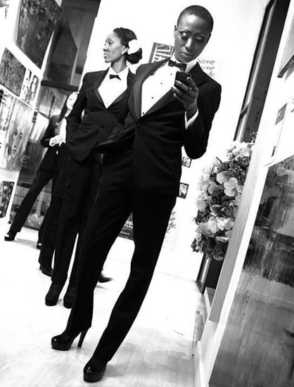

# I Have Just the Thing

*A Superspy Story Game by Zac Gross*

**I Have Just the Thing** is a card-driven storytelling game that emulates spy movies like James Bond or Mission Impossible. The game is intended for 3 or 4 players.

### The Superspy

All players will take turns controlling the same character: Blue Cobra, an international superspy. She's competent, experienced and well connected all around the globe.

## Starting the Game

The player who most recently consumed any sort of spy media (film, television, etc.) gets the first turn.

### Create a Supervillain

The first player draws one card from the Villain deck and draws one card from the Item deck to insert into the villain description. The first player reads the Villain's plot aloud.

### Cards

Each player starts with a hand of four Function cards.

## Gameplay

The game is played in turns. During a turn, a player narrates a scene and once they are done, control will pass to the player on their left. 

### Turns
On a turn, a player first draws the Scene card for this turn and reads it aloud. For the first scene, read the prompt on the Villain card instead. The player to their left draws three Item cards, chooses one to play face up and discards the others. The controlling player chooses a Function Card from their hand to play.

The played Function Card and the played Item Card for the round defines a cool gadget in the form of: “An [Item] that [Function]” such as “A *golf club* that *poisons sharks*.” The player does not reveal the cards to the other players. The player narrates a scene following the prompt from the Scene Card. The scene must involve Blue Cobra getting into a type of trouble or conflict where her gadget is the perfect thing to get them out of trouble.

> For example, with the golf club that poisons sharks, if the player had drawn the Scene Card for "An ally is killed," the player would narrate a scene where Blue Cobra plays golf with the villain to gain information on them. The villain figures out the ploy, throws Blue Cobra and her caddy into a pool of sharks. The caddy doesn't survive, but luckily Blue Cobra brought her golf club that poisons sharks and is able to take out the sharks and get away.

After their turn, the player places the played Function and Item cards together in front of them. The gadget may be used later in the Conclusion.

### Telling a Scene

The scene should continue the story established by the other players, but a scene can jump around in time. Players can pick up the action immediately after the last scene, jump forward to the next day or go into a flashback. As long as the other players are comfortable, you can establish whatever you want in your scene, but the focus of your scene should be on how the gadget helps Blue Cobra get out of trouble. Players should adapt to their play group, but keeping scenes between one and five minutes long is a good guideline. 

### The Conclusion

After each player has had a turn, any player can choose to start the Conclusion on their turn by saying, "Let's start the conclusion." The Conclusion is one Scene that each player participates in. The Scene prompt is "Blue Cobra defeats the Villain". Starting with the player who began the Conclusion, each player takes a turn narrating a small bit into the scene. They choose one of the gadgets previously created by the player on their right to incorporate into the scene.

After each player has participated in the Conclusion, the player who began the conclusion can optionally narrate an epilogue scene to finish up any remaining story threads. 

## Optional Rules

Try playing with anywhere between 2 and 10 players